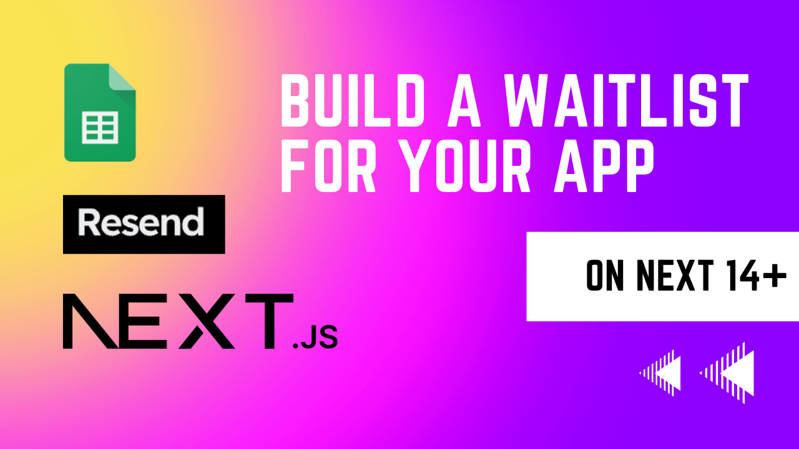
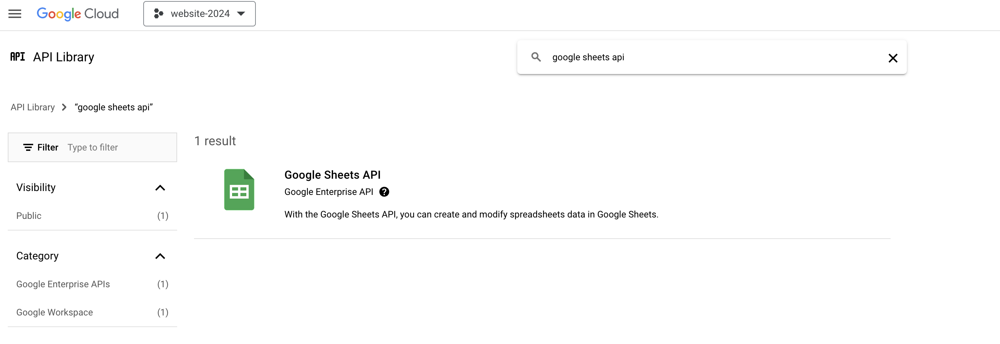
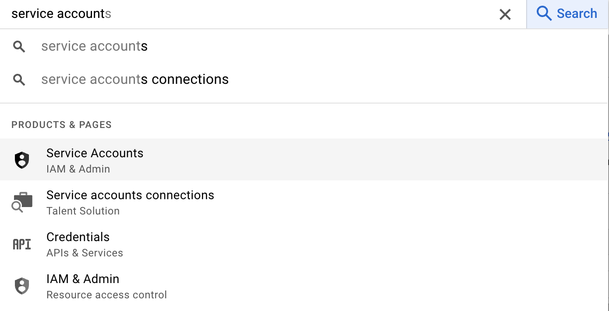
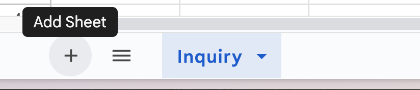

Use `Next.js 14+` with `Google Sheets` and `Resend` to handle your websites wait list form all for free.

# Prerequisites

1. Googleapis
2. Resend APIs

## Setup Google API's

Go to [https://cloud.google.com/](https://cloud.google.com/)

1. Create a Google Cloud Account
2. Enable Google Sheets API
3. Create a Service Account for a web application - you will be given an email, go to your google sheet page and add that email with editor access to the google sheet page you want
4. The service account will help you fill out the environment variables you need to communicate with your google cloud service




## Create a RESEND ACCOUNT

1. Setup and create an account
2. Add a domain name to connect a domain email
3. Create an api key

```sh
GOOGLE_SHEETS_ID=""
GOOGLE_PRIVATE_KEY=<your key>
GOOGLE_PRIVATE_KEY_BUFF=""
GOOGLE_CLIENT_EMAIL=""
GOOGLE_CLIENT_ID=""
GOOGLE_TOKEN_URL=""
GOOGLE_PROJECT_ID=""
RESEND_API_KEY=""
```

## Update where rows get written to

```ts
await sheets.spreadsheets.values.append({
  spreadsheetId,
  range: '[your sheet name]',
  valueInputOption: 'USER_ENTERED',
  requestBody: {
    values: [[Email, Name, Company, Mobile_Phone, Message, Signup_Date]], // Data must be an array of arrays (each inner array represents a row)
  },
})
```



## Local Setup

1. `npm install`
2. `touch env.local` and then add your env variables from above
3. `npm run dev` to start the application

## Full Tech Stack

1. [Next.js with TypeScript](https://nextjs.org/docs)
2. [Googleapis](https://cloud.google.com/)
3. [Resend API](https://resend.com)
4. [TailwindCss](https://tailwindcss.com)
5. [Shadcn/ui](https://ui.shadcn.com)
